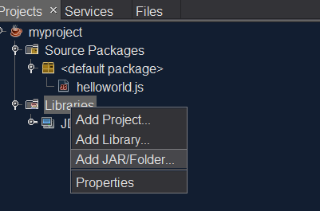
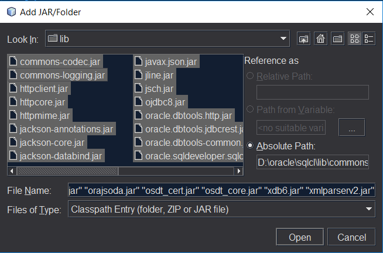

# Testing SQLcl scripts with Netbeans IDE 8.2

You can test SQLcl scripts with Netbeans without using the commandline tool.
This approach is much more efficient than reloading your script in SQLcl after you've made a change.

## 

* [Requirements](#requirements)
* [Add SQLcl JAR files](#add-sqlcl-jar-files)
* [Test](#test)

## Requirements
Make sure you have created a new project as described here.

[Testing Nashorn scripts with Netbeans IDE 8.2](netbeans.md)

Download and extract SQLcl.

http://www.oracle.com/technetwork/developer-tools/sqlcl/downloads/index.html

## Add SQLcl JAR files
We need to add the SQLcl JAR files to our project.
Rightclick **Libraries** and select **Add JAR/Folder**.



Go to the folder where you unzipped SQLcl and select all JAR files.



## Test 
Add this line in your JavaScript file and replace the options with your database connection details:

```javascript
loadWithNewGlobal(
    "https://raw.githubusercontent.com/mennooo/sqlcl/master/demos/demo1.js", 
    {
        sid: "ORCL",
        host: "localhost",
        port: "1521",
        username: "hr",
        password: "hr"
    }
);
```

You should get a similar result:

```
apr 02, 2017 11:25:45 PM oracle.dbtools.jdbc.util.LogUtil log
INFO: oracle.dbtools.jdbc.orest.Driver:<clinit>:27:No Message
apr 02, 2017 11:25:45 PM oracle.dbtools.jdbc.util.LogUtil log
INFO: oracle.dbtools.jdbc.orest.Driver:<clinit>:34::ORest driver loaded
Connecting to jdbc:oracle:thin:@localhost:1521:ORCL
The following query will be executed: select table_name from user_tables where rownum < 4;

TABLE_NAME                                                                      
--------------------------------------------------------------------------------
REGIONS
COUNTRIES
LOCATIONS

BUILD SUCCESSFUL (total time: 5 seconds)
```
