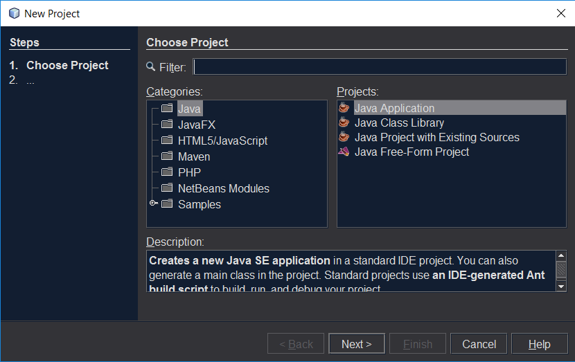
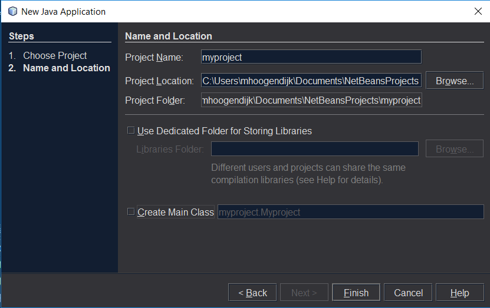
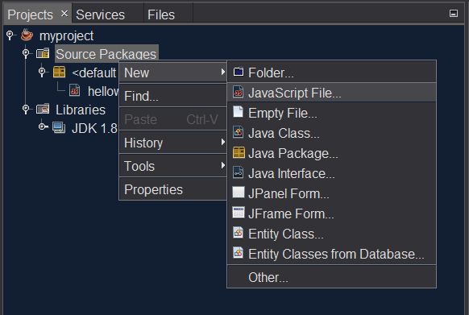
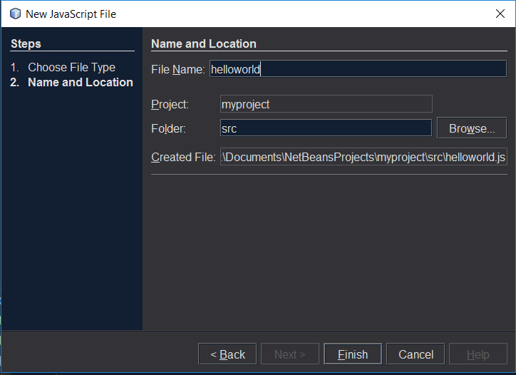
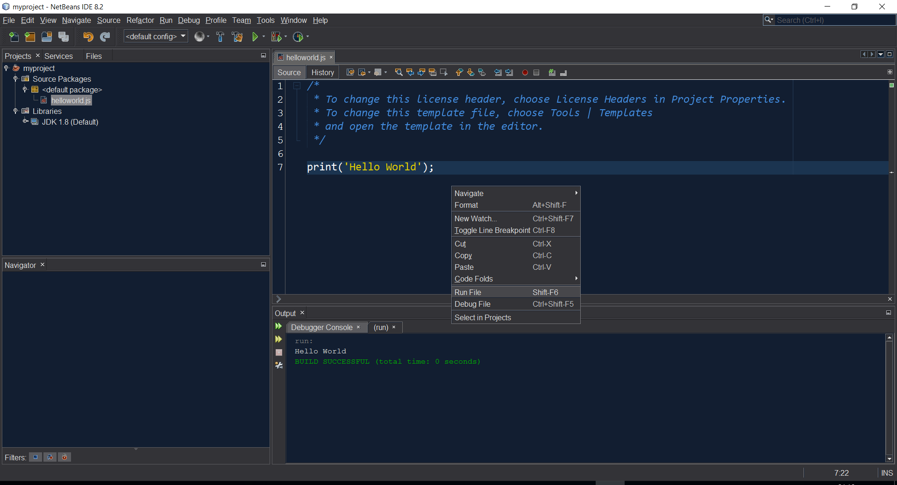

# Testing Nashorn scripts with Netbeans IDE 8.2

Netbeans IDE allows you to run and debug your Nashorn scripts.

* [Requirements](#requirements)
* [Install](#install)
* [Create a new project](#create-a-new-project)

## Requirements
To run the latest version of Nashorn, we need to install JDK 1.8: http://www.oracle.com/technetwork/java/javase/downloads/jdk8-downloads-2133151.html


## Install

You can download Netbeans IDE 8.2 from 
- [https://netbeans.org/downloads/](https://netbeans.org/downloads/)

Choose the Java EE edition because it includes JavaScript.

## Create a new project

Click File --> New Project..

Select **Java Application** and click **Next**.



Deselect **Create Main Class** and click **Finish**.



Add a new JavaScript file. Rightclick on **Source Packages**.
Choose **New** --> **Other**.



Input a filename and click **Finish**.



Now we can create our first Nashorn script. This line of code should work.

```javascript
print('Hello world');
```
Rightclick inside your file and click **Run File**.


