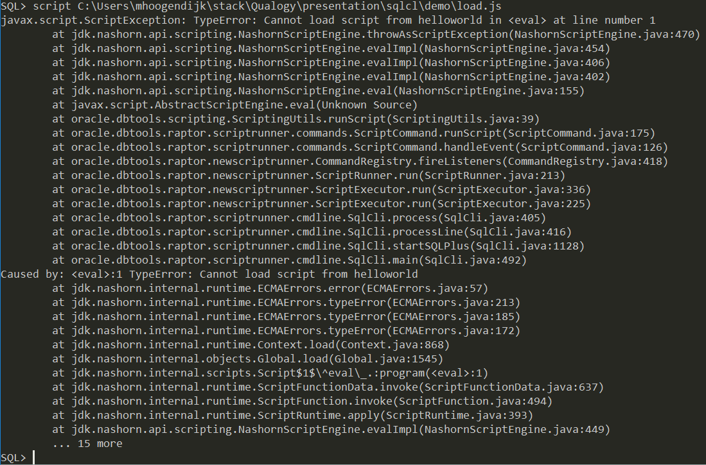

# The script command
Purpose: run JavaScript scripts in SQLcl.
For help in SQLcl type `help script`.

## Inline scripts
Although not very useful, it's the easiest way to execute a script.

1. Start SQLcl

`sql.exe /nolog`

2. Execute script

Type `script` and hit ENTER.

Type a script:
```
ctx.write('My first script\n');
/
```
Output:
```
SQL> script
  2  ctx.write('My first script\n');
  3  /
My first script
SQL>
```
## External scripts
Command: `script <script name>`

You can only run local scripts from your filesystem (and not via URL):

`script d:\scripts\helloworld.js`

Examples:
[https://github.com/oracle/oracle-db-tools/tree/master/sqlcl/examples](https://github.com/oracle/oracle-db-tools/tree/master/sqlcl/examples)

## Tips

### Relative filepaths within the load function
It's (almost) not possible to load scripts using a relative filepath.

`script <script_dir>/load.js`

```javascript
//load.js

// Load a script in same directory as load.js
load("helloworld.js");
// Fails to load the script
```



The reason is that a script is loaded as a **string** and then evaluated as a function. The directory where SQLcl tries to find the file is the directory where you started SQLcl.

Example of script evaluation:
```javascript
eval('load("another-script.js");');
```

The context of these variables in a script are empty:
```javascript
print(__FILE__, __LINE__, __DIR__);
```

A workaround could be:

Change the current working directory to the location of the script

```
cd <script_dir>
script load.js
```

Now you can load the current directory into a variable in your script
```javascript
//load.js

// Java Class to get the current directory
var FileUtils = Java.type("oracle.dbtools.common.utils.FileUtils");

// Load directory into a variable
var cwd = FileUtils.getCWD(ctx);

load(cwd + '/helloworld.js');
```

### Changing the OutputStream
By default the output of a statement is written to the console/terminal. Sometimes you want to write the output to a file for instance.
If spooling a file is not sufficient, you have the option to change the OutputStream.

## Creating a custom command
SQLcl allows you to add custom commands. For instance:


A good example about how to create a script to add a custom command:
- [https://github.com/oracle/oracle-db-tools/blob/master/sqlcl/examples/customCommand.js](https://github.com/oracle/oracle-db-tools/blob/master/sqlcl/examples/customCommand.js)
